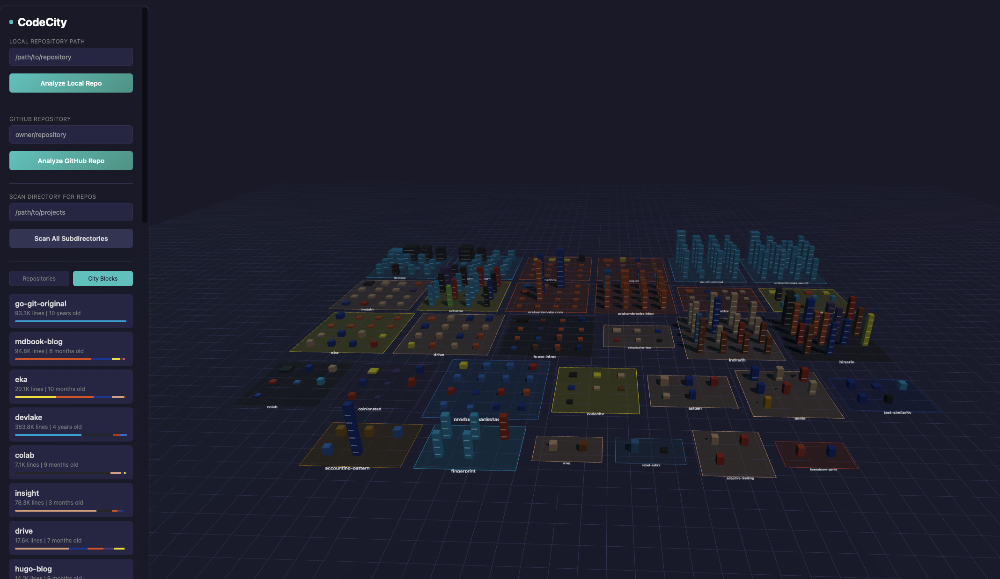

# CodeCity



A 3D visualization tool that renders git repositories as buildings in a city. Each building's characteristics represent different aspects of the repository:

- **Height** = Repository/directory age (days since first commit)
- **Volume** = Lines of code
- **Color** = Primary programming language

## Features

- Visualize local git repositories or GitHub repositories
- Toggle between repository view and directory drill-down view
- Scan entire directories for all git repositories
- Interactive 3D navigation with orbit controls
- Hover tooltips showing repository statistics
- City blocks view showing all repositories with their directories


## Quick Start with Docker

The easiest way to run CodeCity is using Docker Compose:

```bash
# Clone the repository
git clone https://github.com/grahambrooks/codecity.git
cd codecity

# Build and start the containers
docker compose up --build

# Access the application
open http://localhost:3000
```

### Docker Notes

When running in Docker, local repository paths must be prefixed with `/host/` since the host filesystem is mounted at that location. For example:
- Host path: `/Users/me/projects`
- Container path: `/host/Users/me/projects`

## Bazel Build

CodeCity uses Bazel for reproducible builds and Kubernetes deployment.

### Prerequisites

- [Bazel](https://bazel.build/) 7.4+ (or [Bazelisk](https://github.com/bazelbuild/bazelisk) recommended)
- Docker (for container image builds)
- kubectl (for Kubernetes deployment)

### Build Commands

```bash
# Build everything
bazel build //...

# Build specific targets
bazel build //backend:codecity-backend    # Rust backend binary
bazel build //frontend:build              # Frontend static assets

# Build container images
bazel build //backend:image_tarball       # Backend Docker image
bazel build //frontend:image_tarball      # Frontend Docker image
```

### Container Images

Build and load container images into Docker:

```bash
# Build and load images into Docker (using oci_load)
bazel run //backend:image_tarball
bazel run //frontend:image_tarball

# Verify images are loaded
docker images | grep codecity
```

### Kubernetes Deployment with Bazel

Deploy to a local Kubernetes cluster (minikube, kind, or docker-desktop):

```bash
# Full deployment (build images, load to cluster, deploy)
bazel run //k8s:deploy_all

# Or step by step:
bazel run //backend:image_tarball   # Load backend image to Docker
bazel run //frontend:image_tarball  # Load frontend image to Docker
bazel run //k8s:deploy              # Apply K8s manifests

# Check status
bazel run //k8s:status

# Access the application
bazel run //k8s:port_forward
# Then open http://localhost:3000

# Tear down
bazel run //k8s:teardown
```

### Available Bazel Targets

| Target | Description |
|--------|-------------|
| `//backend:codecity-backend` | Rust backend binary |
| `//backend:image` | Backend OCI image |
| `//backend:image_tarball` | Load backend image into Docker |
| `//frontend:build` | Frontend Vite build output |
| `//frontend:image` | Frontend OCI image |
| `//frontend:image_tarball` | Load frontend image into Docker |
| `//k8s:deploy_all` | Build, load images, and deploy to K8s |
| `//k8s:deploy` | Deploy manifests to K8s |
| `//k8s:teardown` | Remove deployment from K8s |
| `//k8s:status` | Show K8s deployment status |
| `//k8s:port_forward` | Start port-forwarding to services |

### Build Configurations

```bash
# Debug build (default)
bazel build //backend:codecity-backend

# Release/optimized build
bazel build --config=release //backend:codecity-backend

# Build for Linux containers (on macOS)
bazel build --config=linux //backend:image
```

## Kubernetes Deployment

Deploy CodeCity to a Kubernetes cluster using the provided manifests.

### Prerequisites

- Kubernetes cluster (minikube, kind, or cloud provider)
- kubectl configured to access your cluster
- Container images built and available (see [Building Images](#building-images))

### Building Images

Build and tag the container images:

```bash
# Build backend image
docker build -t codecity-backend:latest ./backend

# Build frontend image
docker build -t codecity-frontend:latest ./frontend

# For minikube, load images into the cluster
minikube image load codecity-backend:latest
minikube image load codecity-frontend:latest

# For kind, load images into the cluster
kind load docker-image codecity-backend:latest
kind load docker-image codecity-frontend:latest
```

### Deploy with kubectl

```bash
# Apply all manifests
kubectl apply -k k8s/

# Check deployment status
kubectl get pods -n codecity

# Wait for pods to be ready
kubectl wait --for=condition=ready pod -l app.kubernetes.io/name=codecity -n codecity --timeout=120s
```

### Access the Application

**Option 1: Port Forward (development)**
```bash
kubectl port-forward -n codecity svc/frontend 3000:80
# Access at http://localhost:3000
```

**Option 2: Ingress (production)**

The included ingress is configured for `codecity.local`. Update the host in `k8s/ingress.yaml` for your domain, then:

```bash
# Add to /etc/hosts for local testing
echo "127.0.0.1 codecity.local" | sudo tee -a /etc/hosts

# Or use your ingress controller's external IP
```

### Kubernetes Notes

- The manifests deploy to the `codecity` namespace
- Images default to `latest` tag - update `k8s/kustomization.yaml` for specific versions
- Local repository analysis requires mounting the host filesystem (commented out in `backend-deployment.yaml`)
- For cloud deployments, GitHub repository analysis works without additional configuration

### Customization

Use Kustomize overlays to customize for different environments:

```bash
# Preview generated manifests
kubectl kustomize k8s/

# Apply with custom image tags
cd k8s && kustomize edit set image codecity-backend=myregistry/codecity-backend:v1.0.0
kubectl apply -k k8s/
```

## Manual Build

### Prerequisites

- **Backend**: Rust 1.70+ with Cargo
- **Frontend**: Node.js 18+ with npm
- **System**: git, libssl-dev, pkg-config, cmake (for libgit2)

### Backend

```bash
cd backend

# Build
cargo build --release

# Run
cargo run --release
```

The backend server starts on `http://localhost:3001`.

### Frontend

```bash
cd frontend

# Install dependencies
npm install

# Development server (with hot reload)
npm run dev

# Production build
npm run build
```

The development server starts on `http://localhost:3000` and proxies API requests to the backend.

## Usage

### Analyze a Single Repository

1. **Local Repository**: Enter the full path to a git repository and click "Analyze Local Repo"
2. **GitHub Repository**: Enter `owner/repo` format (e.g., `rust-lang/rust`) and click "Analyze GitHub Repo"

### Scan Multiple Repositories

1. Enter a directory path containing multiple git repositories
2. Click "Scan All Subdirectories"
3. All discovered repositories will be analyzed and added to the visualization

### Navigation

- **Left-click + drag**: Rotate the camera
- **Right-click + drag**: Pan the camera
- **Scroll**: Zoom in/out
- **Hover**: Show repository/directory details
- **Click** (in repo view): Switch to directory view for that repository

### Views

- **Repositories**: Each building represents one git repository
- **City Blocks**: Each block represents a repository, with buildings for each directory inside

## API Endpoints

| Method | Endpoint | Description |
|--------|----------|-------------|
| GET | `/api/health` | Health check |
| GET | `/api/repos` | List all analyzed repositories |
| POST | `/api/analyze/local` | Analyze a local repository |
| POST | `/api/analyze/github` | Analyze a GitHub repository |
| POST | `/api/scan` | Scan directory for repositories |
| GET | `/api/repo/{id}` | Get repository details |
| GET | `/api/repo/{id}/tree` | Get repository directory tree |

## Project Structure

```
codecity/
├── MODULE.bazel             # Bazel module definition
├── BUILD.bazel              # Root build file
├── .bazelrc                 # Bazel configuration
├── .bazelversion            # Bazel version pinning
├── backend/                 # Rust API server
│   ├── BUILD.bazel          # Backend build rules
│   ├── Cargo.toml
│   ├── Dockerfile
│   └── src/
│       ├── main.rs          # Entry point, Axum server
│       ├── models.rs        # Data structures
│       ├── api/mod.rs       # REST API handlers
│       ├── git/mod.rs       # Git repository analysis
│       └── github/mod.rs    # GitHub API integration
├── frontend/                # Three.js visualization
│   ├── BUILD.bazel          # Frontend build rules
│   ├── package.json
│   ├── Dockerfile
│   ├── nginx.conf
│   ├── vite.config.js
│   ├── index.html
│   └── src/
│       ├── main.js          # Application entry
│       ├── scene.js         # Three.js 3D scene
│       ├── buildings.js     # Building geometry
│       ├── api.js           # API client
│       ├── ui.js            # UI controls
│       └── colors.js        # Language colors
├── k8s/                     # Kubernetes manifests
│   ├── BUILD.bazel          # K8s deployment rules
│   ├── kustomization.yaml   # Kustomize configuration
│   ├── namespace.yaml
│   ├── backend-deployment.yaml
│   ├── backend-service.yaml
│   ├── frontend-deployment.yaml
│   ├── frontend-service.yaml
│   └── ingress.yaml
├── scripts/
│   └── deploy-k8s.sh        # Full K8s deployment script
├── docker-compose.yml
└── README.md
```

## Language Colors

The visualization uses GitHub's language colors:

| Language | Color |
|----------|-------|
| Rust | #DEA584 |
| JavaScript | #F7DF1E |
| TypeScript | #3178C6 |
| Python | #3776AB |
| Go | #00ADD8 |
| Java | #B07219 |
| C++ | #F34B7D |
| Ruby | #CC342D |

...and 20+ more languages.

## Technology Stack

### Backend
- **Rust** with Axum web framework
- **git2** for Git operations (libgit2 bindings)
- **octocrab** for GitHub API
- **tokio** async runtime

### Frontend
- **Three.js** for 3D rendering
- **Vite** for development/build
- Vanilla JavaScript (no framework)

## License

MIT
